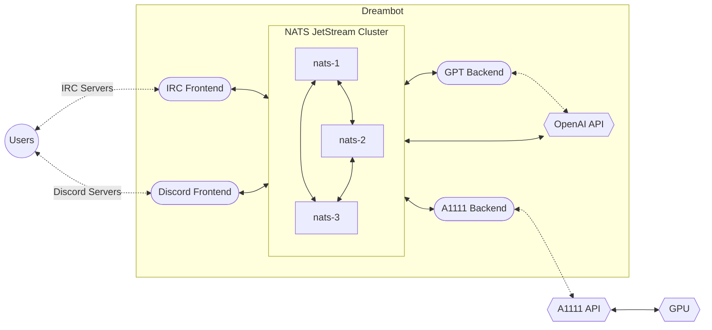

# Dreambot

by Chris Jones <cmsj@tenshu.net>

## What is it?

Dreambot is a distributed architecture for running chat bots.



## What are Frontends and Backends?

* Dreambot is designed to run as multiple processes, each of which is either a frontend or a backend.
* Each of these processes is intended to subscribe to one or more message queues in [NATS](https://nats.io), from which it will receive messages.
* Frontends listen for trigger keywords from users and then publish them to NATS, where they are picked up by the backends.
* Backends then perform the requested work and publish the results back to NATS, where they are picked up by the frontends and sent back to the user.

## What are the current Frontends and Backends?

Frontends:

* IRC
* Discord

Backends:

* [OpenAI](https://www.openai.com)'s GPT [Chat Completions](https://platform.openai.com/docs/api-reference/chat/create)
* [A1111](https://github.com/AUTOMATIC1111/stable-diffusion-webui)'s fork of Stable Diffusion

## Why is this architecture so complicated for a simple chat bot?

The initial prototype was designed to run an IRC bot frontend on a server that is trusted to talk to the Internet, and a Stable Diffusion backend process on a machine that is not trusted to talk to the Internet, with a websocket connection between them.

While this prototype worked well, it was not easy to extend to support Discord and additional types of backend. With the current design, each process knows nothing about the other processes, and can be run on any machine that can connect to the NATS cluster.

Additionally, it can be useful to spread out backends across machines that have relevant GPU hardware, and it's beneficial to have each backend in its own process because AI/ML code tends to have extremely specific requirements for Python and dependency library versions, which may not all be compatible in a single module.

## How do I deploy this?

I deploy all of this using Docker Compose, and here are the approximate steps I use. This all assumes:

* You're running Ubuntu Server 22.04
* You have an NVIDIA GPU that you want to use for A1111
* You have ample storage in `/srv/docker/` to attach to the containers (in particular, A1111 will need >10GB for its model cache)
* You have a web server running that can serve files from `/srv/public/`

### Stages

---

<details>
    <summary>Create the required directories</summary>

```bash
mkdir -p /srv/docker/nats/{config,nats-1,nats-2,nats-3}
mkdir -p /srv/docker/A1111/data
mkdir -p /srv/docker/dreambot/config
```

</details>

---

<details><summary>Create the required files</summary>

---

#### NATS config file

<blockquote>
<details><summary>/srv/docker/nats/config/nats-server.conf</summary>

```text
host: 0.0.0.0
port: 4222
http: 0.0.0.0:8222
max_payload: 8388608 # Default is 1MB, but we send images over NATS, so bump it to 8MB

jetstream {
    store_dir: /data
    # 1 GB
    max_memory_store: 1073741824
    # 10 GB
    max_file_store: 10737418240
}

cluster {
    name: dreambot
    host: 0.0.0.0
    port: 4245
    routes: [
        nats-route://nats-1:4245,
        nats-route://nats-2:4245,
        nats-route://nats-3:4245
    ]
}
```

</details></blockquote>

---

#### Install A1111

See their docs for this

---

#### Dreambot config files

<blockquote>
<details><summary>/srv/docker/dreambot/config/config-frontend-irc.json</summary>

Notes:

* Triggers need to have a trailing space (this is an obvious deficiency that I should just fix - I can add the space in code)
* `uri_base` should be where your webserver has this container's `/data` volume mounted

```json
{
  "triggers": {
          "!gpt": "backend.gpt",
          "!dream": "backend.a1111"
  },
  "nats_uri": [ "nats://nats-1:4222", "nats://nats-2:4222", "nats://nats-3:4222" ],
  "output_dir": "/data",
  "uri_base": "https://dreams.mydomain.com",
  "irc": [
        {
                "nickname": "dreambot",
                "ident": "dreambot",
                "realname": "I've dreamed things you people wouldn't believe",
                "host": "irc.server.com",
                "port": 6667,
                "ssl": false,
                "channels": [
                        "#dreambot"
                ]
        },
        {
                "nickname": "dreambot",
                "ident": "dreambot",
                "realname": "I've dreamed things you people wouldn't believe",
                "host": "irc.something.org",
                "port": 6667,
                "ssl": false,
                "channels": [
                        "#dreambot",
                        "#chat"
                ]
        }

  ]
}
```

</details></blockquote>

<blockquote>
<details><summary>/srv/docker/dreambot/config/config-frontend-discord.json</summary>

There is a bunch of Discord developer website stuff you need to do to get the token for this file, and you will need to give it permissions I haven't documented yet

```json
{
  "triggers": {
          "!gpt": "backend.gpt",
          "!dream": "backend.a1111"
  },
  "nats_uri": [ "nats://nats-1:4222", "nats://nats-2:4222", "nats://nats-3:4222" ],
  "output_dir": "/data",
  "discord": {
    "token": "abc123"
  }
}
```

</details></blockquote>

<blockquote>
<details><summary>/srv/docker/dreambot/config/config-backend-gpt.json</summary>

Sign up for a developer account at [https://openai.com](https://openai.com) and you can get your API key and organization ID from there.

```json
{
  "gpt": {
      "api_key": "ab-abc123",
      "organization": "org-ABC123",
      "model": "gpt-3.5-turbo"
  },
  "nats_uri": [ "nats://nats-1:4222", "nats://nats-2:4222", "nats://nats-3:4222" ],
}
```

</details></blockquote>

<blockquote>
<details><summary>/srv/docker/dreambot/config/config-backend-a1111.json</summary>

The A1111 backend supports arguments for choosing between several models. Install the models you want in A1111 and (optionally, but recommendedly) configure it to keep several models in VRAM at the same time. Play with the settings to get what you want and then configure the settings that will be sent with each request, in the json config:

```json
{
  "a1111": {
      "host": "a1111",
      "port": "9090",
      "default_model": "sdxl",
      "models": {
        "sdxl": {
                "payload": {
                  "hr_upscaler": "SwinIR_4x",
                  "sampler_name": "Euler a",
                  "seed": -1,
                  "restore_faces": "True",
                  "cfg_scale": 1.0,
                  "override_settings": {
                      "sd_model_checkpoint": "sd_xl_turbo_1.0_fp16"
                  },
                  "steps": 1
                }
        },
        "real": {
           "payload": {
                  "sampler_name": "DPM++ SDE",
                  "scheduler": "Karras",
                  "seed": -1,
                  "restore_faces": "True",
                  "steps": 5,
                  "cfg_scale": 1.6,
                  "override_settings": {
                      "sd_model_checkpoint": "realisticVisionV60B1_v51HyperVAE"
                  }
           }
        }
  },
  "nats_uri": [ "nats://nats-1:4222", "nats://nats-2:4222", "nats://nats-3:4222" ],
}
```

</details></blockquote>

</details>

---
<details><summary>Ansible playbook to install/configure CUDA (required for A1111 backend)</summary>

To run a container that accesses GPUs for CUDA, you need to install nvidia drivers, the nvidia-container-toolkit package, and then configure the docker daemon to use it as a runtime.

```yaml
- name: Install cuda keyring
ansible.builtin.apt:
    deb: https://developer.download.nvidia.com/compute/cuda/repos/ubuntu2204/x86_64/cuda-keyring_1.0-1_all.deb
    state: present

- name: Install nvidia/cuda packages
ansible.builtin.apt:
    name: "{{ item }}"
    update_cache: yes
with_items:
    - nvidia-headless-530
    - nvidia-utils-530
    - cuda-toolkit

# Based on: https://docs.nvidia.com/datacenter/cloud-native/container-toolkit/install-guide.html#docker
- name: Install nvidia-container-toolkit apt key
ansible.builtin.shell:
    cmd: curl -fsSL https://nvidia.github.io/libnvidia-container/gpgkey | gpg --dearmor -o /usr/share/keyrings/nvidia-container-toolkit-keyring.gpg
    creates: /usr/share/keyrings/nvidia-container-toolkit-keyring.gpg

- name: Add the nvidia-container-toolkit apt repo
ansible.builtin.shell:
    cmd: curl -s -L https://nvidia.github.io/libnvidia-container/ubuntu22.04/libnvidia-container.list | sed 's#deb https://#deb [signed-by=/usr/share/keyrings/nvidia-container-toolkit-keyring.gpg] https://#g' | tee /etc/apt/sources.list.d/nvidia-container-toolkit.list
    creates: /etc/apt/sources.list.d/nvidia-container-toolkit.list

- name: Install the nvidia-container-toolkit package
ansible.builtin.apt:
    name: nvidia-container-toolkit
    update_cache: yes

- name: Configure nvidia-container-toolkit runtime
ansible.builtin.shell:
    cmd: nvidia-ctk runtime configure --runtime=docker
```

Then restart the docker daemon, and you should be able to run containers that access the GPUs.
</details>

---

<details>
    <summary>Docker Compose for deploying the Dreambot infrastructure</summary>

```yaml
networks:
    dreambot:
        external: false
        driver: bridge

services:
    # Deploy a NATS cluster
    nats-1:
        hostname: nats-1
        image: nats
        restart: unless-stopped
        networks:
            - dreambot
        expose:
            - "8222"
        volumes:
            - /srv/docker/nats/nats-1:/data
            - /srv/docker/nats/config:/config
        entrypoint: /nats-server
        command: --name nats-1 -c /config/nats-server.conf

    nats-2:
        hostname: nats-2
        image: nats
        restart: unless-stopped
        networks:
            - dreambot
        expose:
            - "8222"
        volumes:
            - /srv/docker/nats/nats-2:/data
            - /srv/docker/nats/config:/config
        entrypoint: /nats-server
        command: --name nats-2 -c /config/nats-server.conf

    nats-3:
        hostname: nats-3
        image: nats
        restart: unless-stopped
        networks:
            - dreambot
        expose:
            - "8222"
        volumes:
            - /srv/docker/nats/nats-3:/data
            - /srv/docker/nats/config:/config
        entrypoint: /nats-server
        command: --name nats-3 -c /config/nats-server.conf

    # Deploy A1111 with access to our GPU
    a1111:
        hostname: a1111
        image: ghcr.io/neggles/sd-webui-docker:latest
        restart: unless-stopped
        deploy:
        resources:
            reservations:
            devices:
                - driver: nvidia
                count: 1
                capabilities: [gpu]
        networks:
            - dreambot
        environment:
            CLI_ARGS: "--skip-version-check --allow-code --enable-insecure-extension-access --api --xformers --opt-channelslast"
            SD_WEBUI_VARIANT: "default"
            # make TQDM behave a little better
            PYTHONUNBUFFERED: "1"
            TERM: "vt100"
        expose:
            - "9090"
        volumes:
            - /srv/docker/a1111/data:/data
            - /srv/public/outputs:/outputs # This is where the outputs of A1111 will be stored if you talk to it directly rather than through Dreambot (e.g. their web interface)

    # Deploy the Dreambot Frontends
    dreambot-frontend-irc:
        hostname: dreambot-frontend-irc
        image: ghcr.io/cmsj/dreambot:latest
        restart: unless-stopped
        networks:
            - dreambot
        volumes:
            - /srv/docker/dreambot/config:/config
            - /srv/public/dreams:/data
        command: dreambot_frontend_irc -c /config/config-frontend-irc.json

    dreambot-frontend-discord:
        hostname: dreambot-frontend-discord
        image: ghcr.io/cmsj/dreambot:latest
        restart: unless-stopped
        networks:
            - dreambot
        volumes:
            - /srv/docker/dreambot/config:/config
            - /srv/public/dreams:/data
        command: dreambot_frontend_discord -c /config/config-frontend-discord.json

    # Deploy the Dreambot Backends
    dreambot-backend-gpt:
        hostname: dreambot_backend_gpt
        image: ghcr.io/cmsj/dreambot:latest
        restart: unless-stopped
        networks:
            - dreambot
        volumes:
            - /srv/docker/dreambot/config:/config
            - /srv/public/dreams:/data
        command: dreambot_backend_gpt -c /config/config-backend-gpt.json

    dreambot-backend-a1111:
        hostname: dreambot_backend_a1111
        image: ghcr.io/cmsj/dreambot:latest
        restart: unless-stopped
        networks:
            - dreambot
        volumes:
            - /srv/docker/dreambot/config:/config
            - /srv/public/dreams:/data
        command: dreambot_backend_a1111 -c /config/config-backend-a1111.json

```

</details>

---

## That's a lot of setup, holy cow

Yes, it is.
